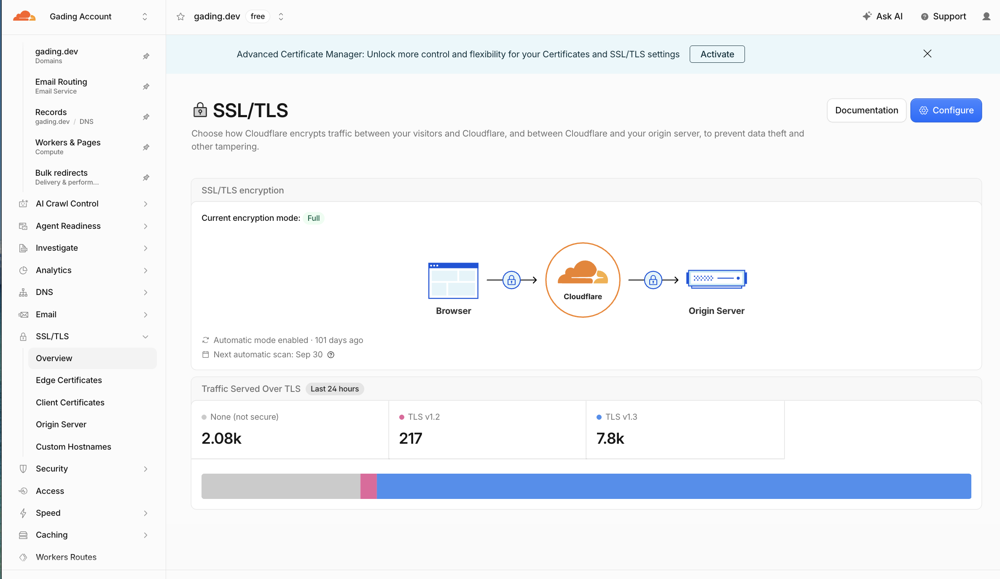
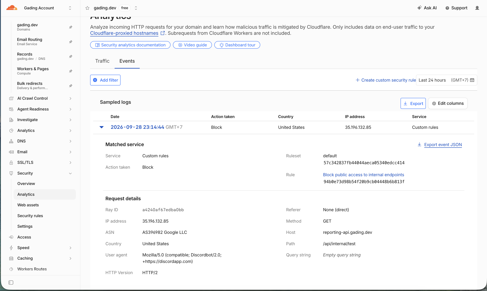

# Cloudflare layer (scored bonus) — CDN, WAF, and custom TLD domain

Putting Cloudflare in front of any of the four clouds above is worth extra
credit. The goal: one custom apex domain, TLS everywhere, and an edge that
protects the APIs.

## 0. Assumed hostnames

| Host                            | Origin                                                             |
| ------------------------------- | ------------------------------------------------------------------ |
| `ledgerlab.example.com`         | dashboard (CloudFront / Firebase / Static Web App / Render static) |
| `api.ledgerlab.example.com`     | ledger API                                                         |
| `reports.ledgerlab.example.com` | reporting API                                                      |

Replace `example.com` with a domain you actually control. A real **TLD** (not a
`*.onrender.com` / `*.run.app` URL) is required for the bonus.

## 1. DNS + TLS

1. Add the site to Cloudflare and change the registrar's nameservers.
2. Create `A`/`CNAME` records for the three hostnames.
3. **Proxy status: Proxied (orange cloud)** so traffic flows through Cloudflare.
4. SSL/TLS mode: **Full (strict)**. Enable **Always Use HTTPS** and **HSTS**
   (max-age 31536000, includeSubDomains, preload). Enable **Automatic HTTPS
   Rewrites**.

## 2. WAF and rate limiting

- Enable **Managed Rulesets** (Cloudflare OWASP Core Ruleset) for all three hosts.
- Add a **rate limiting rule**: 100 requests / minute per IP on
  `api.ledgerlab.example.com/*` and `reports.ledgerlab.example.com/*`, action
  **Block** for 60s. Tune to observed traffic; document the numbers you chose.
- Block `POST` to `/api/internal/*` from the public internet entirely — that
  path is service-to-service only. Example custom rule expression:

  ```
  (http.host eq "api.ledgerlab.example.com" and starts_with(http.request.uri.path, "/api/internal/"))
  ```

  Action: **Block**.

- Add a **bot fight mode** / managed challenge on `/login` if you add auth.

## 3. Cache rules

| Path                             | Setting                                               |
| -------------------------------- | ----------------------------------------------------- |
| `ledgerlab.example.com/assets/*` | Cache everything, Edge TTL 1 year (assets are hashed) |
| `ledgerlab.example.com/*`        | Bypass cache (SPA document)                           |
| `api.*`, `reports.*`             | Bypass cache; never cache authenticated API responses |

Enable **Brotli**. Set **Browser Cache TTL** to "Respect Existing Headers".

## 4. Origin hardening

- Lock origins to Cloudflare: use **Authenticated Origin Pulls** (mTLS) or an
  origin firewall rule that only allows Cloudflare IP ranges.
- Add a **Transform Rule** to strip the `Server` header and set
  `X-Content-Type-Options`, `Referrer-Policy`, and CSP response headers.
- Optionally use **Cloudflare Tunnel** (`cloudflared`) so the API origin has no
  public ingress at all. This is the strongest option and scores well:
  `cloudflared tunnel create ledgerlab` then route `api.ledgerlab.example.com`
  to `http://localhost:4001`.

## 5. Verification evidence (committed in repo)

The live verification evidence for `gading.dev` is committed in `deployment/cloudflare/evidence/`:

- **Terminal outputs**: [`evidence/verification-output.txt`](evidence/verification-output.txt) (contains live `dig`, `curl -sI`, and WAF `403` edge block outputs).
- **SSL/TLS Overview**: 
- **WAF Security Block Event**: 

```bash
# 1. Anycast Cloudflare IPs
dig +short ledgerlab.gading.dev
# 172.67.202.247
# 104.21.65.174

# 2. TLS Full + HTTP/2 + cf-ray
curl -sI https://ledger-api.gading.dev/health
# HTTP/2 200, cf-ray: a4241afdce0bfd87-SIN, server: cloudflare

# 3. WAF Edge Block on /api/internal/*
curl -s -o /dev/null -w '%{http_code}\n' -X POST https://ledger-api.gading.dev/api/internal/postings
# 403 (Blocked at edge before hitting origin tunnel)
```

## 6. Terraform sketch (optional)

If you prefer IaC, the provider is `cloudflare/cloudflare`. Minimum resources:
`cloudflare_zone`, `cloudflare_record` (proxied), `cloudflare_zone_settings_override`
(min_tls_version 1.2, ssl full, always_use_https), plus a `cloudflare_ruleset`
for the rate-limit and `/api/internal` block rules. Commit the plan output.
