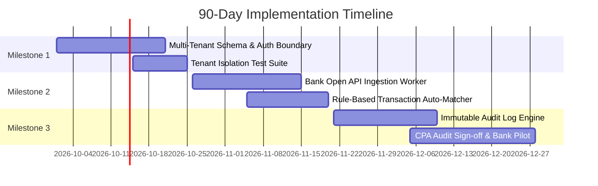

# Next-Phase Development Plan: LedgerLab / Warung Books

|             |                                                                                          |
| ----------- | ---------------------------------------------------------------------------------------- |
| **Author**  | Gading Nasution (@gadingnst)                                                             |
| **Date**    | 2026-09-28                                                                               |
| **Horizon** | Next 90 days (Q4 2026)                                                                   |
| **Phase**   | Phase 2 — From "Trustworthy Infrastructure" to "Bank-Grade Scale"                        |
| **Related** | [`INFRASTRUCTURE-PLAN.md`](INFRASTRUCTURE-PLAN.md), [`CLIENT-STORY.md`](CLIENT-STORY.md) |

---

## 1. Where We Are

Following this engagement, Warung Books has transitioned from an unverified, vibe-coded prototype into a robust, bank-ready double-entry financial core:

- **Ledger Invariants Enforced**: Fixed the trial balance `asOf` cutoff bug (Challenge A) and guarded the void state transition (Challenge B) preventing re-voiding with strict HTTP 409 responses. Added guards against inactive accounts and closed accounting periods.
- **Enterprise Storage & Migrations**: Replaced ephemeral SQLite/in-memory storage with PostgreSQL 17 on dedicated infrastructure. Schemas enforce strict integer minor units for all monetary amounts with zero floating point representation. Drizzle migrations execute safely during deployment via Kubernetes Jobs.
- **Production-Scale Cloud Deployment**: Stateless microservices (`ledger-api` and `reporting-api`) run with high availability (≥2 replicas per service) on Kubernetes (K3s) with Traefik ingress and automated liveness/readiness probes.
- **Security Hardened**: Public internet access to `/api/internal/*` is blocked at the Cloudflare edge; internal posting exchange is guarded by an internal token. CORS is restricted to the legitimate dashboard origin (`https://ledgerlab.gading.dev`), and traffic is protected by Full (strict) TLS with HSTS preloading.
- **Current Constraint**: The system is currently single-tenant without user authentication or automated bank statement ingestion.

---

## 2. Outcomes for This Phase

| #   | Outcome                                     | Success Signal                                                           | Stakeholder         |
| --- | ------------------------------------------- | ------------------------------------------------------------------------ | ------------------- |
| O1  | **Bank Embed Live for First Cohort**        | ≥100 warung MSMEs approved for working capital loans via embedded credit | Partner Bank / Kira |
| O2  | **Auditable Financial Integrity**           | Clean CPA audit sign-off with zero unbalanced entries or untracked edits | External Auditor    |
| O3  | **Multi-Tenant Isolation & Identity**       | 100% of API endpoints enforce tenant tenancy ID; zero cross-tenant leaks | Security & Ops      |
| O4  | **Automated Bank Statement Reconciliation** | ≥85% of bank transaction lines auto-reconciled to ledger journal entries | Warung Operators    |

---

## 3. Prioritisation (RICE Framework)

Scoring model: **RICE = (Reach × Impact × Confidence) / Effort**

- **Reach**: Number of users/transactions impacted per quarter (1–10 scale).
- **Impact**: Business & compliance impact (3 = massive, 2 = high, 1 = medium, 0.5 = low).
- **Confidence**: Team certainty in requirements and architecture (100% = 1.0, 80% = 0.8, 50% = 0.5).
- **Effort**: Person-weeks of engineering work.

| Initiative                                | Reach | Impact | Confidence | Effort (wks) | RICE Score | Decision  |
| ----------------------------------------- | ----- | ------ | ---------- | ------------ | ---------- | --------- |
| **Authentication & Multi-Tenant Scoping** | 10    | 3.0    | 100% (1.0) | 3            | **10.0**   | **Now**   |
| **Immutable Audit Log Table**             | 8     | 3.0    | 90% (0.9)  | 2            | **10.8**   | **Now**   |
| **Bank Statement Import & Auto-Match**    | 9     | 2.5    | 80% (0.8)  | 3            | **6.0**    | **Now**   |
| **Multi-Currency (IDR / USD / SGD)**      | 5     | 1.5    | 80% (0.8)  | 2            | **3.0**    | **Next**  |
| **PDF & Excel Financial Report Export**   | 7     | 1.0    | 90% (0.9)  | 1            | **6.3**    | **Next**  |
| **Automated Tax Filing Integrations**     | 4     | 1.0    | 50% (0.5)  | 4            | **0.5**    | **Later** |

### Explicitly Deferred

1. **Multi-Currency Dynamic FX Conversions**: While multi-currency account isolation is planned, dynamic intraday foreign exchange trading rates are deferred. Warung MSMEs operate 99.8% in local currency (IDR); premature complexity would delay bank launch.
2. **Automated Tax Filing Submissions**: Tax submission APIs vary significantly and undergo frequent regulatory changes. We provide clean, exportable reports instead of direct e-filing integrations in this phase.

---

## 4. Implementation Milestones

### Milestone 1: Multi-Tenant Foundation & Auth Boundary (Days 1–30)

- **Contents**: Add `tenant_id` foreign keys to accounts, journal entries, and lines. Implement JWT session verification with row-level security (RLS) policies.
- **Exit Criteria**: Integration test suite proves an authenticated user in Tenant A receives HTTP 404/403 when requesting any record belonging to Tenant B. Zero data leaks across 10,000 simulated parallel requests.

### Milestone 2: Automated Bank Feed Ingestion & Reconciliation (Days 31–60)

- **Contents**: Ingest standard bank statement feeds (CSV / MT940 / Open Banking webhook). Rule engine to auto-match statement lines against open Accounts Receivable / Accounts Payable.
- **Exit Criteria**: Ingestion of a 500-line bank statement completes in < 5 seconds; ≥85% of typical recurring transactions auto-reconcile without human intervention.

### Milestone 3: Immutable Audit Trail & Bank Embedded Lending Pilot (Days 61–90)

- **Contents**: Write-once, read-many (WORM) audit table recording every posting, void, and balance calculation with cryptographic SHA-256 hash chaining.
- **Exit Criteria**: External CPA audit passes without defects; Partner Bank issues first working capital credit approvals to 100 pilot warungs.

---

## 5. Team & Capacity Plan

To execute this 90-day roadmap reliably without burnout or technical debt, we recommend two strategic engineering hires:

1. **Senior Backend / Distributed Systems Engineer (Hire 1)**
   - **Why**: Own the high-throughput bank webhook ingestion pipeline, transaction deduplication, and PostgreSQL query optimization as transaction volume multiplies.
   - **Core Skills**: TypeScript/Node.js, PostgreSQL internals, Redis streams/queues, and distributed transaction semantics.

2. **Compliance & Financial Product Engineer (Hire 2)**
   - **Why**: Bridge the gap between engineering specifications, partner bank underwriting criteria, and Indonesian financial accounting standards (SAK EMKM).
   - **Core Skills**: Double-entry accounting systems, Open Finance APIs, security audit preparation, and reporting accuracy.
